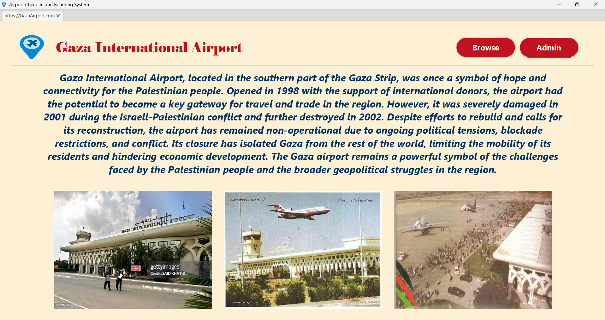
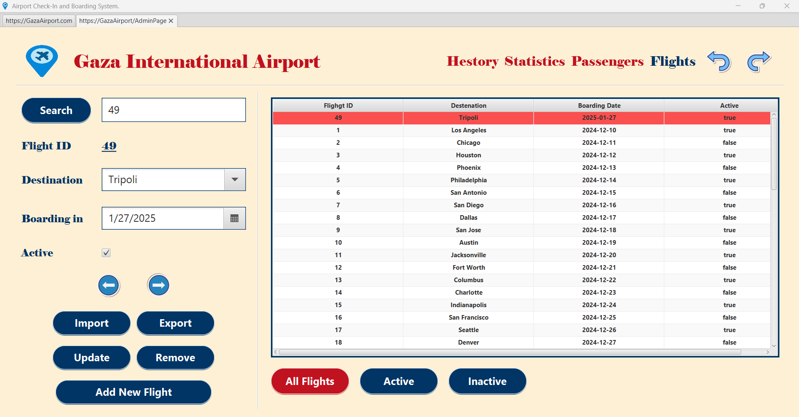
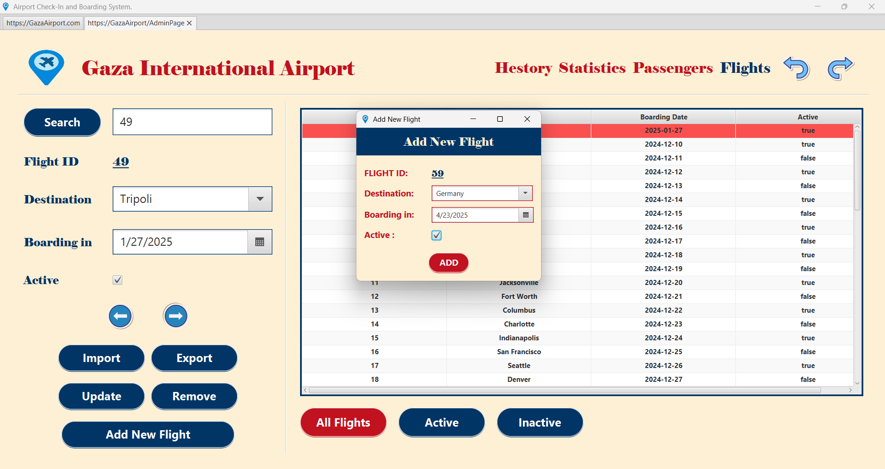
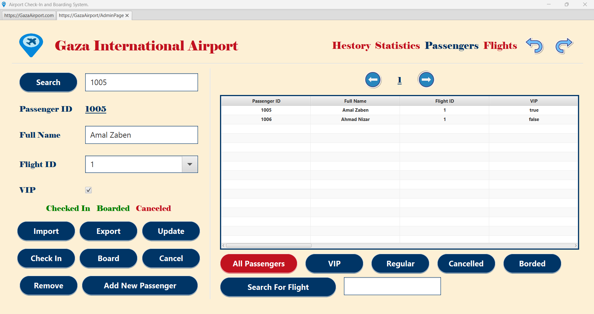
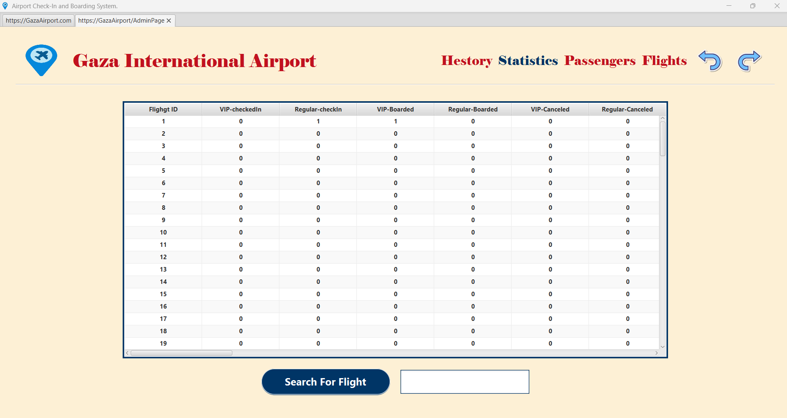

# 🛫 Airport Management System

A custom-built airport management system developed in Java for a Data Structures course.
This project showcases hand-written implementations of core data structures to efficiently manage flights, passengers, and system operations.

## ✈️ Features

- **Flight Management**  
  Manage both active and inactive flights.

- **Passenger Management**  
  Handle various passenger states including:
  - Checked-in
  - Boarded
  - Cancelled

- **Undo/Redo Operations**  
  Built using a **custom stack data structure**, enabling full reversal or reapplication of actions.

- **Flight & Passenger Statistics**  
  View insightful metrics for each flight and its passengers.

- **Action History Log**  
  Every operation is recorded and can be exported to a `.txt` file for review or audit purposes.

- **Admin-Focused Design**  
  Tailored for backend/administrative use, with a focus on control and clarity.

## 📸 Screenshots

<!-- Screenshots will be added here -->

## 🧠 Technologies Used

- **Language**: Java
- **Custom Structures**: Stack, Linked List , Queue.
- **I/O**: File handling for exporting logs and history

